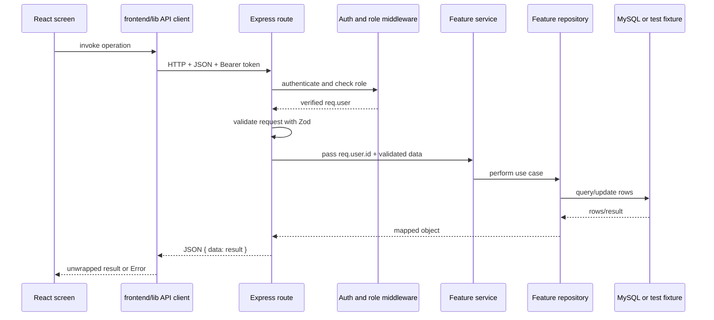

# Student and Landlord Implementation Study Guide

This guide follows the code currently in this repository. Read one session, trace the listed files, then explain the flow aloud without looking. The goal is to understand the implementation well enough to answer follow-up questions, not to memorize code.

## How To Use This Tonight

There are eight sessions of roughly 20-30 minutes each. If time is tight, do Sessions 1-5, then read the defense questions and implementation caveats. Keep the relevant files open in VS Code while practicing.

## The One-Minute Architecture

The frontend is React + TypeScript, served by Vite. Its student and landlord screens call API helper functions. Those helpers use one shared `fetch` wrapper, which adds the stored bearer token, sends JSON, unwraps the API's `{ data: ... }` response, and turns non-2xx responses into errors.

The backend is an Express + TypeScript API. Its routes authenticate and authorize the request, validate input with Zod, call a service, and return JSON. Services delegate the use case to repositories. Repositories use parameterized MySQL queries and map database rows into API-shaped objects. Tests switch repositories to in-memory fixtures.

Key files to keep handy: [Student dashboard](frontend/pages/StudentDashboard/index.tsx), [Landlord dashboard](frontend/pages/LandlordDashboard/index.tsx), [API transport](frontend/lib/api.ts), [Student API client](frontend/lib/studentApi.ts), [Landlord API client](frontend/lib/landlordApi.ts), [Student routes](backend/src/routes/student.ts), [Landlord routes](backend/src/routes/landlord.ts), [Student repository](backend/src/student/repository.ts), [Landlord repository](backend/src/landlord/repository.ts).

## Session 1: Learn The Layers

**Goal:** Be able to point to where a request enters, where its rules live, and where data is stored.

Trace these files in order:

1. `frontend/pages/StudentDashboard/index.tsx` and `frontend/pages/LandlordDashboard/index.tsx`: screen state and event handlers.
2. `frontend/lib/studentApi.ts` and `frontend/lib/landlordApi.ts`: endpoint functions and response normalization.
3. `frontend/lib/api.ts`: shared HTTP transport.
4. `backend/src/routes/student.ts` and `backend/src/routes/landlord.ts`: endpoint, auth, validation, status code.
5. `backend/src/student/service.ts` and `backend/src/landlord/service.ts`: use-case boundary.
6. `backend/src/student/repository.ts` and `backend/src/landlord/repository.ts`: persistence and row-to-contract mapping.

**Explain these terms:**

- **Route/controller:** HTTP-specific responsibilities: URL, request, status code, response.
- **Service:** named business operation; currently intentionally thin and delegates to a repository.
- **Repository:** database access and persistence mapping.
- **Contract/schema:** the shape and validation rules for data crossing a boundary.
- **DTO/API object:** the JSON shape returned to a client; it need not be identical to the SQL row.

**Practice:** Follow `GET /api/v1/student/applications` from the screen's initial load down to the SQL `WHERE a.student_id = ?`. Then say what each layer contributes.

**Checkpoint:** You should be able to explain why the frontend should not query MySQL directly: the API is the trusted boundary for permissions, validation, business rules, and persistence.

## Session 2: HTTP, Authentication, Validation, And Errors

**Goal:** Explain how the app knows who is calling and prevents the wrong role from using a route.

### Login and subsequent requests

1. Login verifies credentials in `backend/src/auth/auth.ts` and creates a signed JWT. The token expires after 12 hours; persistent mode also records a hashed token session.
2. The frontend stores the token as `uiu_auth_token` and the basic user display data as `uiu_user` in local storage (`persistAuthSession` in `frontend/lib/api.ts`).
3. Every API call reads the token and sends `Authorization: Bearer <token>`.
4. Backend `requireAuth` verifies the token, checks its session/user status, then places the user on `req.user`.
5. Student routes use `router.use(requireAuth, requireRole('student'))`; landlord routes use the landlord role. Missing/invalid authentication is 401; wrong role is 403.
6. The route passes `req.user.id` to the service. The client does not get to choose the acting student's or landlord's identity.

Landlord registration starts in `pending` status, so an administrator must activate that account before it can use protected landlord operations. Student accounts are active by default in the registration flow.

### Validation and errors

- Zod validates and trims request data in the route. Examples: `StudentApplicationPayloadSchema`, `LandlordListingPayloadSchema`, `MaintenanceUpdatePayloadSchema`.
- TypeScript helps while developing, but it does not validate untrusted HTTP JSON at runtime. Zod does.
- `AppError` represents expected failures such as duplicate applications or missing listings. Central error middleware returns a consistent `{ error: { code, message, statusCode } }` shape.
- The frontend wrapper extracts the message; on HTTP 401 it also clears the stored auth session.
- `asyncHandler` forwards rejected async route handlers to Express's central error handler.
- CORS is a browser-origin allowlist, not authentication. It does not replace checking the token and role.

**Practice questions:** What is the difference between 401 and 403? Why is role-checking on the server required even if the UI hides a page? What does Zod add beyond a TypeScript type?

**Checkpoint:** Answer: "A student cannot become a landlord by changing frontend state because the API authenticates the bearer token and authorizes its role on every protected route."

## Session 3: Student Browsing, Favorites, And Applications

**Goal:** Understand the core student journey from finding a property to asking to rent it.

### Browse listings

The dashboard calls `fetchPublicListings` from the student API client. It translates UI filters into query parameters and calls public `GET /api/v1/listings`. The listing API returns public listing data; the client normalizes differing backend fields and IDs into the shared frontend `Listing` shape. Browse does not require student authentication.

The normalized frontend listing ID and its public property code are not interchangeable concepts. The backend can resolve an internal numeric ID or a `property_code` such as `UIU-1001`; public codes are preferable in user-facing URLs and requests.

### Favorites

- `POST /api/v1/student/favorites/:listingId` adds a favorite; `DELETE` removes it; `GET` lists the current student's favorites.
- The route gets the student ID from the authenticated token. The repository scopes the SQL by `student_id` and resolves the supplied listing identifier.
- A duplicate favorite is a conflict (409), not a second duplicate row.

### Applications

- Student submits `POST /api/v1/student/applications` with property, move-in date, and optional contact/application information.
- Zod validates the payload; the repository resolves the property, checks that it exists and is available, derives the landlord from the property row, checks for an existing under-review application, then inserts the application.
- The student ID comes from `req.user.id`; the frontend cannot submit an application on behalf of another student by putting a different student ID in the body.
- The initial status is `under-review`; landlord decisions use the same application record.
- Student can list applications and cancel one. The SQL mutation also scopes by `student_id`.

**Data path to trace:** `handleSubmitApplication` in the student dashboard -> `submitApplication` in `frontend/lib/studentApi.ts` -> `POST /api/v1/student/applications` -> route schema -> `studentService.submitApplication` -> `studentRepository.submitApplication` -> `applications` table.

**Practice:** Explain why the repository derives `landlord_id` from the selected property instead of trusting a landlord ID supplied by the student.

## Session 4: Landlord Listings And Application Decisions

**Goal:** Explain how listings are managed and how the student/landlord workflows meet.

### Listing ownership

- Landlords can list, create, partially update, and delete their listings.
- The acting landlord ID always comes from the token.
- Listing reads filter on `properties.landlord_id`. Updates and deletes include both property ID and landlord ID in the database operation, so another landlord cannot modify that record just by guessing an ID.
- Listing payloads are validated by `LandlordListingPayloadSchema`; the route uses `.partial()` for a patch.
- The repository maps frontend/API listing concepts into the older property table's fields and maps amenities through `amenities` and `property_amenities`.

### Reviewing an application

1. Landlord requests `GET /api/v1/landlord/applications`; repository returns applications associated with properties owned by that landlord.
2. Landlord sends `PATCH /api/v1/landlord/applications/:applicationId/status` with a new status and optional decision notes.
3. Repository verifies that the application belongs to a property owned by this landlord.
4. Rejection or a review status changes the application state.
5. Acceptance also performs workflow side effects: other active/pending applications for the student are cancelled, any previous active lease is ended and its old property reopened, a lease is created if needed, an initial rent obligation is created, and the selected property becomes occupied.

The end-to-end crossing point is covered in [student-session2.test.ts](backend/test/student-session2.test.ts) and [session4-hardening.test.ts](backend/test/session4-hardening.test.ts). In tests the same behavior is represented with maps; the production repository uses MySQL.

**Practice:** Draw the state transition `under-review -> accepted -> active lease -> occupied property`. Then explain why acceptance is more than a status update.

**Important design discussion:** The acceptance workflow currently executes several database statements sequentially without a single explicit transaction. If asked about keeping all those side effects atomic, say that an improvement is to obtain one pooled connection and wrap the updates/inserts in `BEGIN`, `COMMIT`, and `ROLLBACK`.

## Session 5: Leases, Rent, And Receipts

**Goal:** State exactly what the rent feature does and does not do.

- Lease listing is scoped to the current student or landlord. Student and landlord repository queries join leases to properties and users to produce display details.
- When a landlord accepts an application, the repository creates an active lease (if one does not already exist) and a pending rent obligation for the current month.
- `GET /api/v1/student/rent` reads obligations through the student's lease; `GET /api/v1/student/receipts` reads receipts for those obligations.
- `POST /api/v1/student/rent/:obligationId/pay` verifies that the obligation belongs to this student and is in a payable status, changes its status to `paid`, and inserts a receipt number.
- **This is not a real payment gateway integration.** The route accepts an optional `method`, but the repository currently ignores it. No external processor authorization, webhook, or settlement is shown in this code path. Describe it as a payment-state/receipt workflow or prototype payment, not a live card/mobile-financial-service transaction.

**Practice questions:** How does the API stop a student from paying another student's obligation? What creates the initial rent obligation? What evidence would a true gateway integration need (provider request, verified callback/webhook, idempotency, transaction state)?

**Checkpoint:** Follow `POST /api/v1/student/rent/:obligationId/pay` and point to the ownership predicate: the query joins the obligation's lease and requires `l.student_id = ?`.

## Session 6: Maintenance Requests And Two-Sided Updates

**Goal:** Understand the shared workflow where the student creates a request and the landlord works it.

### Student side

- Student sends a maintenance request with a property, landlord, issue, description, and priority.
- The route validates required fields and optional attachment metadata.
- The repository resolves the property and checks that the provided landlord actually owns it before inserting the request with status `open`, stage `1`.
- Student reads only requests whose `student_id` matches the authenticated user and can read/post comments after ownership checks.

### Landlord side

- Landlord sees requests filtered by their `landlord_id`.
- `PATCH /api/v1/landlord/maintenance/:requestId/status` updates the stage/status only for a request assigned to that landlord.
- Stage is an integer from 0 through 6. The implementation maps stage `< 2` to `open`, stage 2-4 to `in-progress`, and stage `>= 5` to `resolved`.
- Landlord and student comment endpoints check request ownership before accessing or inserting comments.

**Practice:** Explain why checking that a property belongs to the submitted landlord is different from checking that the current user is a student. Both are needed: the student role authorizes the caller, while the property check validates the relationship among request data.

**Current limitation to know:** The request accepts attachment metadata, and a migration contains a `maintenance_attachments` table, but the shown student repository insert does not persist attachment metadata/files. Do not claim file upload/storage is implemented end-to-end.

## Session 7: Other Dashboard Features And Frontend State

**Goal:** Summarize the rest of the student/landlord scope without pretending every feature has equal depth.

### Profiles

Both dashboards load profile data and have update endpoints. Student updates include name, phone, and student ID. Landlord update validation includes company name, but the repository currently only writes name and phone to `users`; there is no company field persisted in that update path.

### Reviews and complaints

Students can read and submit reviews (1-5 stars for landlord and property) and complaints. Both roles have complaint endpoints. The repository determines or resolves related identity/property data rather than trusting every submitted display field.

### Frontend loading and normalization

- Dashboard startup loads multiple resources with `Promise.all`.
- Individual loads use `.catch(() => fallback)` so, for example, a missing rent result does not prevent the profile and listings from rendering.
- Components hold UI state in React state; event handlers call the API client and then update/refetch relevant state.
- API clients normalize snake_case/camelCase and backend enum values into UI types. This is an adapter boundary, not business authorization.
- A `useEffect` cleanup flag avoids applying a result after the component has unmounted.

**Practice:** Pick one field that changes shape between SQL and UI (for example `price`/`priceBDT` or `property_code`/`propertyCode`) and trace the conversion.

## Session 8: Tests, Run Path, And Mock Defense

**Goal:** Show how you know the behavior works and answer sensible follow-ups.

### Tests

- Backend tests use Vitest + Supertest. They import `buildApp()` and make HTTP requests without starting the dev server.
- With `NODE_ENV=test`, auth/repositories use in-memory users/maps instead of relying on a running MySQL database. These are useful API/workflow tests, but they are not a substitute for a live MySQL integration test.
- [student-session2.test.ts](backend/test/student-session2.test.ts) covers authenticated profile, duplicate favorites, application submission/cancellation/reapplication, review history, and collection endpoints.
- [session4-hardening.test.ts](backend/test/session4-hardening.test.ts) covers public property-code favorite removal, mismatch validation, listing updates/ownership, maintenance stages, and lease/property changes after acceptance.
- Run backend checks from `backend/`: `npm test` and `npm run build`.

### Local run path

- Backend dev server: from `backend/`, run `npm run dev`; default API base is `http://localhost:4000`.
- Frontend dev server: from the project root, run `npm run dev`; Vite reads `VITE_API_URL` if set, otherwise the API client falls back to `http://localhost:4000`.
- CORS must include the frontend origin in `CORS_ALLOWED_ORIGINS`.
- Database setup uses `npm run db:setup` from `backend/` after setting the environment/database up.

### Likely teacher questions

**Q: Why separate route, service, and repository?**  
A: The route owns HTTP, auth, validation, and response codes; the service names the use case; the repository owns SQL and mapping. It keeps UI/HTTP concerns from becoming database code and makes persistence easier to test or replace.

**Q: How do you prevent IDOR / access to another user's records?**  
A: The authenticated user ID is sourced from the verified token, then included in repository queries/updates. For landlord-owned resources, the query also checks landlord ownership. For student-owned resources, it filters by student ID.

**Q: What is CORS and is it enough to protect the API?**  
A: CORS controls which browser origins may read responses. It is not authentication. Protected routes still verify bearer token and role, then ownership at the data layer.

**Q: Why use parameterized SQL?**  
A: Values are sent separately from SQL text, which prevents user input from being interpreted as SQL syntax. Dynamic column lists are assembled only from known fields, while values use `?` placeholders.

**Q: Why validate on the backend if React validates the form?**  
A: A client can be bypassed or modified. Backend validation protects the API regardless of client and produces consistent errors.

**Q: What does a status code mean here?**  
A: 200 is a successful read/update, 201 is a created resource, 204 is successful deletion with no response body, 400 is invalid input/state, 401 is unauthenticated, 403 is forbidden, 404 is missing/not found, and 409 is a conflict such as duplicate application/favorite.

**Q: Is rent paid online?**  
A: The current API simulates completion by marking an eligible obligation paid and recording a receipt. It does not call a real payment provider.

**Q: Do tests use the same storage as production?**  
A: Tests use in-memory fixture maps when `NODE_ENV=test`, and call the real Express route stack via Supertest. The test suite verifies HTTP behavior and workflow logic, but it does not prove SQL behavior against a live database.

**Q: What would you improve next?**  
A: Make acceptance and payment state changes transactional, add end-to-end MySQL integration coverage, integrate a real payment provider with verified webhooks and idempotency, and persist maintenance attachment uploads. I would also align the listing moderation/availability model and make frontend/backend schemas stricter and shared where practical.

## Five-Minute Final Review

Close the guide and explain these in your own words:

1. One GET and one POST path all the way from React to MySQL.
2. How a JWT becomes `req.user`, and why the request body does not choose the current user.
3. How a landlord's listing ownership is enforced.
4. What happens when an application is accepted.
5. What the rent feature does and what it does not do.
6. What the tests use instead of MySQL and what that means for confidence.

If you can explain those six points and navigate to their implementation, you have the core of this part ready for a presentation.

## Accuracy Notes About This Repository

- `backend/README.md` says Express 5, but `backend/package.json` currently depends on Express 4. The code's `asyncHandler` documentation correctly describes why forwarding rejected handlers matters in Express 4. If asked, state what the dependency says, not the stale README line.
- The root `backend/database/schema.sql` is an older baseline. Current workflow tables such as `leases`, `rent_obligations`, and `payment_receipts` are added by migrations (and are represented in Prisma). Explain that setup applies migrations; do not claim the baseline SQL alone contains every runtime table.
- Property moderation and availability are not represented as fully separate concepts in the landlord repository's mapping to the legacy `properties.status` column. Say what the current mapping does rather than describing an ideal moderation workflow.
- Several development/demo defaults exist. Keep your presentation focused on the actual request path and distinguish fixture behavior from MySQL behavior.